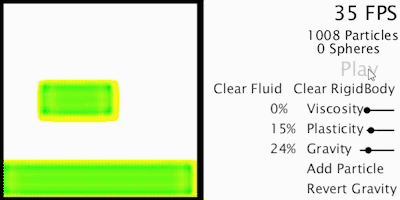

# Particle-based Viscoelastic Fluid Simulation

This repo is a Java implementation of the [Particle-based Viscoelastic Fluid Simulation](https://dl.acm.org/doi/10.1145/1073368.1073400) 
paper by Simon Clavet, Philippe Beaudoin, and Pierre Poulin.

Fluids are the most common material we can find in the world. However,
the behaviour of fluids is complex, and researchers have been
making efforts to understanding and representing the dynamic behaviour
of fluids using mathematical models. Clavet et al. introduce
a novel particle-based model to simulate fluids with viscosity and
elasticity. In this method, Incompressibility
and particle anti-clustering are enforced with a double density
relaxation procedure. This procedure updates particle positions
according to two opposing pressure terms.

Detailed implementation report can be found [here](report.pdf)



# Build Instructions

The code is written in Java with Maven.

## 1. Obtain the Jar Files

### Option 1:

- Make sure the [Maven](https://maven.apache.org/download.cgi) is installed.
- JDK is required to build the project
    - If using Windows or Linux, please use the latest JDK version (at least Java SE 8)
    - If using Mac, Please make sure run **on** the JDK SE 8. (The processing library only works on JDK 8 for Mac)
- Unzip the project.zip `unzip project.zip`
- `cd` into the directory with `pom.xml`
- Run the maven command to generate Jar files: `mvn clean package`
- You should be able to find two Jar files `2DSimulation.jar`, `3DSimulation.jar` in `target/` directory

### Option 2: Compile and Run in IDE

The two main entry classes for 2D Simulation and 3D Simulation are: `Simulation.java`, `3DSimulation.java`

## 2. Execute the Jar Files

### 2D Implementation

To run the 2D-version with GUI, please use the following command:

```java -jar 2DSimulation.jar [model-number]```

- `model-number` is the pass-in argument that can be 0, 1, 2, 3, 4, 5. If not provided, the GUI would load model 0 as default.

You should be able to see the 2D GUI, and you can play around with it.

### 3D Implementation

The 3D-version Java code only generate fluid-data into a file named `3DSimulationResult.txt`:

```java -jar 3DSimulation.jar [model-number] [frame-limit]```

- `model-number` is the pass-in argument that can be 0, 1, 2, 3, 4. If not provided, model 0 will be used.

- `frame-limit` is an integer specifies the number of frame to be generated. If not provided, the default value is 250.

## 3. Generate 3D Animation

- Please make sure you have installed the latest version of [Blender](https://www.blender.org/)
  and [Python 3](https://www.python.org/download/releases/3.0/)
- Open a new blender project and run the script `data-import.py`
    - *IMPORTANT*: You may need to change the line 5 of `data-import.py` to point to the correct location of the generated fluid-data file
    - The recommended way to run the python script is to:
        - Create a new Blender project
        - Use the internal text editor of Blender (Shift + F11) to run the python script
        - In this way, the required library is automatically loaded and the particles can be directly loaded to the Blender project
- You should be able to see the animation in Blender

# Video

Please enjoy the 5-minute presentation video on [Youtube](https://youtu.be/QO6mFMIu8HA).